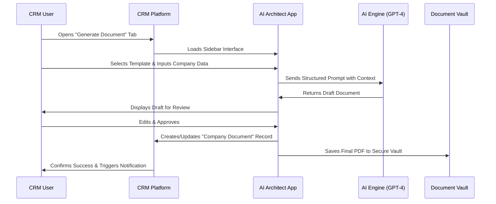

# AI Compliance & Culture Architect 🤖⚖️

**Seamlessly generate industry-specific company profiles, handbooks, and policy documents directly within your CRM.**

## Overview 🌟

The **AI Compliance & Culture Architect** is a powerful integration that transforms your CRM into a dynamic policy and document generation hub. Leveraging advanced AI, it automatically creates tailored, industry-specific compliance documents, employee handbooks, and company profiles, ensuring consistency, saving countless hours of manual work, and mitigating regulatory risk.

Stop copying and pasting from outdated templates. Generate precise, professional, and compliant documents in seconds.

## Key Features ✨

*   **🧠 AI-Powered Document Generation:** Instantly create drafts for company profiles, codes of conduct, safety manuals, and non-disclosure agreements.
*   **🏭 Industry-Specific Intelligence:** Generates documents tailored to the legal and cultural nuances of your industry (Healthcare, Finance, Tech, etc.).
*   **🔗 Deep CRM Integration:** Works seamlessly within your existing CRM (HubSpot, Salesforce, Zoho) using custom objects and sidebar apps. No context switching required.
*   **📑 Dynamic Template Library:** Access a constantly updated library of document templates for every business need, all customizable through a simple form.
*   **⚖️ Compliance Guardrails:** Built-in checks to help ensure generated content adheres to core regulatory frameworks like GDPR, CCPA, and HIPAA*.
*   **♻️ Version Control & Audit Trail:** Automatically track changes and maintain a history of all generated documents for auditing purposes.

_*Note: Always have legal counsel review AI-generated content._

## How It Works 🔧

## Use Cases 🎯

*   **Onboarding New Clients:** Generate a tailored services agreement or NDA instantly after creating a company record.
*   **Scaling Your Team:** Quickly produce a customized employee handbook for a new hire based on their role and location.
*   **Preparing for Audit:** Ensure all client-facing documentation is consistent, up-to-date, and easily accessible.
*   **Entering New Markets:** Adapt your core company profile and policies to meet the specific requirements of a new industry or region.

## Installation & Setup 🚀

### Prerequisites
- An active account with a supported CRM (HubSpot, Salesforce, or Zoho).
- Administrator access to your CRM to install custom applications.
- An API key for OpenAI GPT-4.

### Installation Steps (HubSpot Example)

1.  **Download:** Clone this repository or download the latest package from [Releases](https://github.com/yourusername/ai-compliance-architect/releases).
2.  **Install App:** In your HubSpot account, navigate to `Settings` > `Marketplace` > `App Marketplace` and click `Upload app`. Select the downloaded `.zip` file.
3.  **Configure API Key:** In the app settings, navigate to the `Configuration` tab and enter your OpenAI API key.
4.  **Configure Custom Objects:** The installer will automatically create the required "Company Document" custom object.
5.  **Assign Permissions:** Ensure your team members have the correct permissions to access the app and custom objects.

### Generating Your First Document

1.  Navigate to a **Company** record within your CRM.
2.  Look for the **"AI Compliance Architect"** tab in the sidebar.
3.  Select a document template (e.g., "Company Profile").
4.  Fill in any specific details in the form provided.
5.  Click **"Generate Draft."**
6.  Review, edit, and approve the generated text. It will automatically be saved to the company's record.

## Architecture ⚙️

The application is built on a modern, secure microservices architecture:

*   **Frontend:** React.js application embedded as a CRM sidebar app.
*   **Backend:** Node.js server handling business logic and API requests.
*   **AI Integration:** Secure proxy server managing prompts and responses to the OpenAI API.
*   **Data Storage:** Utilizes CRM custom objects for metadata and a secure cloud storage bucket (e.g., AWS S3) for final PDF documents.
*   **Security:** All API calls are encrypted in transit. Sensitive data like API keys are stored using the CRM's encrypted secrets store.

## Contributing 🤝

We welcome contributions! Please feel free to submit pull requests or open issues for bugs and feature requests.

1.  Fork the Project
2.  Create your Feature Branch (`git checkout -b feature/AmazingFeature`)
3.  Commit your Changes (`git commit -m 'Add some AmazingFeature'`)
4.  Push to the Branch (`git push origin feature/AmazingFeature`)
5.  Open a Pull Request

Please read our `CONTRIBUTING.md` guide for detailed instructions.

## License 📄

This project is licensed under a proprietary license. See the `LICENSE` file for details. All rights reserved.

## Disclaimer ⚠️

**Important:** This tool generates drafts and should be used as a starting point for human review. It is not a substitute for professional legal advice. You are solely responsible for ensuring that any generated document meets your specific needs and complies with all applicable laws and regulations. Always consult with a qualified legal professional before implementing any new policy or agreement.

## Support & Documentation 📚

*   **[Full Documentation](https://github.com/yourusername/ai-compliance-architect/wiki)** – Get detailed guides on installation, configuration, and usage.
*   **[Community Discussions](https://github.com/yourusername/ai-compliance-architect/discussions)** – Ask questions, share ideas, and get help from other users.
*   **Report a Bug** – Please use the [GitHub Issues](https://github.com/yourusername/ai-compliance-architect/issues) page to report any bugs.

---
**Automate your compliance. Empower your culture.**